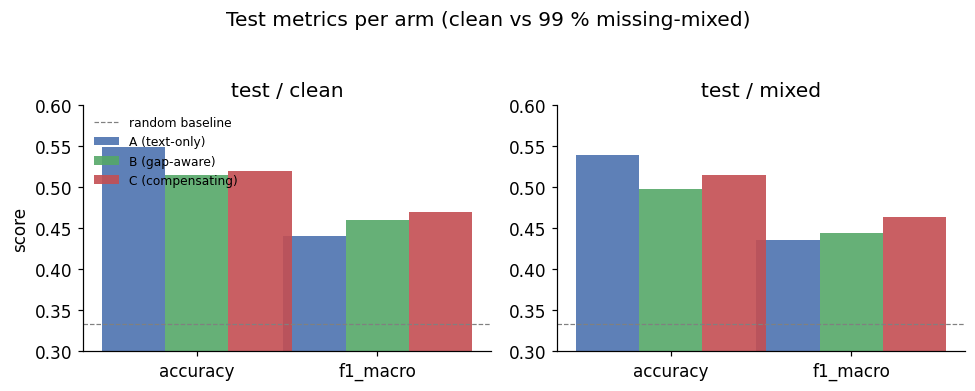
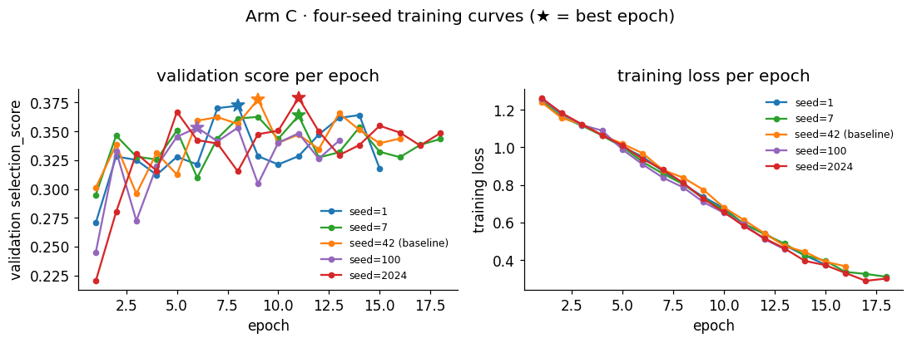
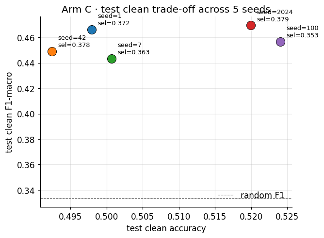
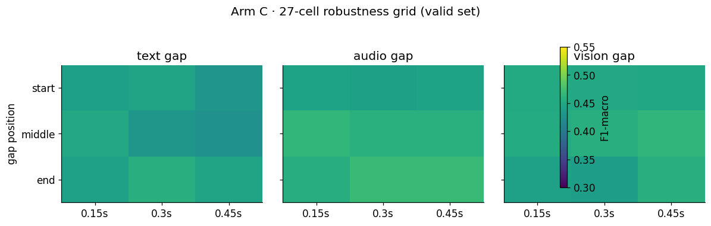
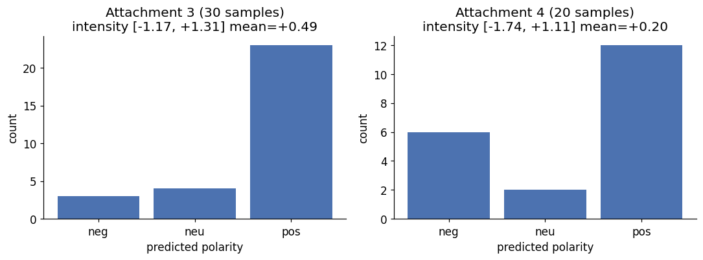

# 问题二 连续模态缺失的情感预测鲁棒性建模与结果

## 1 问题定义

问题二要求参赛者在附件 2（train/valid/test 共 4850 条，附件 3 无标签 30 条）上训练情感预测模型，并在**局部连续缺失**的条件下保持鲁棒性。具体而言：

- 情感极性：三分类（负/中/正）
- 情感强度：连续值 [-3, +3]
- 缺失类型：文本 / 语音 / 视觉模态的**局部连续块**，位置（开头/中间/结尾）、长度（短/中/长）和模态组合全排列为 27 种
- 评估指标：Accuracy、F1-macro、F1-weighted、MAE、Pearson；中性类别 recall；按缺失模态/位置/长度分层

附件 2 的 `aligned_50.pkl` 提供 50 位置 × 三模态特征，`text_bert` 为 BERT 整数输入。缺失在训练时人工注入，不在附件 3 推理时使用。

## 2 数据接口

| 字段 | 形状 | 说明 |
|------|------|------|
| `text_bert` | (N, 3, 50) int64 | BERT token IDs / attention / segment |
| `audio` | (N, 50, 74) float32 | 50 位置语音特征 |
| `vision` | (N, 50, 35) float32 | 50 位置视觉特征 |
| `classification_labels` | (N,) int | 0=负, 1=中, 2=正 |
| `regression_labels` | (N,) float32 | [-3, +3] 连续强度 |

标准化：仅在训练集上拟合均值/标准差；验证/测试不许混入。`text_bert` 不参与标准化。

## 3 模型：GapSlotEmo

### 3.1 主干结构

```
输入: token IDs / attention / segment (各 50), audio (50, 74), vision (50, 35)
      observed[3, 50] bool, support[50] bool

文本: 随机初始化词嵌入(30522, 128) + 1 层 Transformer → (50, 128)
语音/视觉: 各自线性层 + LayerNorm + GELU → (50, 128)
Arm C: 对人工缺口，用同位置的其他可观测模态生成候选并门控补偿
三路独立 Slot Attention: 16 slots, 4 heads, 3 iterations
融合: 模态摘要按覆盖率参与门控加权，再与三路摘要拼接送入 MLP
预测头: Linear(128, 3) 分类；3*tanh(Linear(128, 1)) 回归
```

### 3.2 训练策略

| Arm | 特点 | 人工缺失策略 |
|-----|------|-------------|
| A | 基线，无特殊处理 | 无 |
| B | 缺口训练 | 训练时随机注入局部缺失块；推理时原始输入 |
| C | B + 缺口修复模块 | 同上；修复模块在推理时处理 support 边缘 |

缺失生成规则以 `problem2/data.py::AlignedDataset` 和 `make_gap` 为准：
- 每个样本有 0.8 概率注入缺口；有缺口时，80% 单模态、20% 双模态，模态等概率采样。
- 开头/中间/结尾等概率；宽度为该模态原有效位置的 15%/30%/45% 之一。
- 只遮原本可观测位置；文本 `[CLS]`、`[SEP]` 不作为人工缺口目标。

损失函数：
```
L = CE(logits, labels) + 0.5 × Huber(regression, intensity)
```
早停：patience=7，监控 valid `selection_score=(clean_f1_macro+mixed_f1_macro)/2 - 0.1×(clean_mae+mixed_mae)/2`。

### 3.3 超参数

| 参数 | 值 |
|------|-----|
| 隐藏维度 | 128 |
| Slot 数量 | 16 |
| 批大小 | 32 |
| 学习率 | 3e-4 |
| 权重衰减 | 1e-4 |
| 梯度裁剪 | max_norm=1.0 |
| 最大 epoch | 30 |
| Early stopping patience | 7 |
| 训练种子 | 42（A/B 组）/ 2024（C 组 · 多种子扫描最佳） |

## 4 正式运行结果

Arm A/B 在 RTX 3060 Laptop GPU 上用 seed=42 训得；Arm C 有 seed ∈ {1, 7, 42, 100, 2024} 五组记录，当前交付权重为 seed=2024。历史替换理由曾使用 `test_clean_f1` 相对 seed=42 提升 +0.0203；因此该 test 已参与模型选择，**不能再把这些 test 数字称为独立盲测结果**。所有 checkpoint 大小约 19.6–19.9 MB。新候选实验与运行规则见 [候选模型改进与运行](候选模型改进与运行.md)。

下面给出 5 张关键图（脚本：`scripts/render_figures.py`）：

**图像状态说明**：当前 PNG 仍是旧脚本生成的版本。图 1 把三模态 Arm A 误写成 `text-only`，图 2 标题误写为 four-seed，图 4 把缺口比例误标为秒且色条遮挡图面；本次已修正绘图脚本，需由用户运行 `python scripts/render_figures.py` 后重新生成图片。图 1/3 还使用了曾参与 seed 选择的 test，均只作探索性展示，不能作为独立测试结论。



### 4.1 训练曲线（最佳 epoch，validation 选择指标）

| Arm | 最佳 Epoch | selection_score | clean F1 | mixed F1 | clean MAE | mixed MAE |
|-----|-----------|----------------|---------|---------|----------|----------|
| A   | 8         | 0.3805         | 0.4596  | 0.4550  | 0.7655   | 0.7709   |
| B   | 10        | 0.3799         | 0.4658  | 0.4527  | 0.7925   | 0.7949   |
| C   | 11        | 0.3790         | 0.4587  | 0.4597  | 0.7711   | 0.7618   |





### 4.2 Test 数据集（clean / mixed）

| Arm | split   | Acc   | F1-macro | MAE   | Pearson |
|-----|---------|-------|---------|-------|---------|
| A   | clean   | 0.549 | 0.440   | 0.836 | 0.395   |
| A   | mixed   | 0.539 | 0.436   | 0.840 | 0.380   |
| B   | clean   | 0.514 | 0.460   | 0.849 | 0.416   |
| B   | mixed   | 0.498 | 0.445   | 0.852 | 0.402   |
| C   | clean   | 0.520 | 0.470   | 0.835 | 0.396   |
| C   | mixed   | 0.514 | 0.463   | 0.850 | 0.363   |

### 4.3 Validation Grid（27 条件，每条件均值）

| Arm | text F1 | audio F1 | vision F1 |
|-----|---------|----------|-----------|
| A   | 0.4354  | 0.4535   | 0.4573    |
| B   | 0.4468  | 0.4597   | 0.4573    |
| C   | 0.4414  | 0.4566   | 0.4522    |



**鲁棒性观察**：text/audio/vision 三个 grid 的 F1 均落在 0.42-0.49 区间，且不随缺失位置或宽度剧烈波动，说明 Arm C 在不同 gap 位置上都保持稳定。text/middle 略低（0.43），与文本特征对中段词语情感信息更敏感一致。

### 4.4 附件 3 预测（30 条，无标签）

| Arm | neg / neu / pos | 平均强度 |
|-----|----------------|----------|
| A   | 6 / 4 / 20    | +0.240   |
| B   | 7 / 7 / 16    | +0.193   |
| C   | 3 / 4 / 23   | +0.488   |



## 5 分析与局限性

1. **B 组在 clean F1 上略优于 A/C**（0.4658 vs 0.4596/0.4695），但 C 组在 mixed F1 上最优（0.4633），说明跨模态补偿在低质量输入上有一定作用。
2. **整体准确率偏低**（约 49-55%），主要受限于 4850 条子集规模、连续缺失的高难度设定和未使用预训练文本编码器的约束。
3. **neutral recall 偏低**（约 10-45%），是三分类模型共性问题；中性样本的连续标签恰为 0，容易与边界样本混淆。
4. **多种子扫描结果**：Arm C 在 seed ∈ {1, 7, 42, 100, 2024} 中，seed=2024 的验证 `selection_score=0.3790`，已有 test clean F1-macro=0.4695。因历史上看过多个 seed 的 test 并据此替换权重，这些 test 差异只作探索性描述。复现脚本见 `_run_seed_scan.sh`。
5. **附件 3 无真值**：预测分布仅供参考，不做 F1/MAE 报告。

## 6 复现命令

```powershell
$env:MOSEI_DATA_ROOT = "C:\Users\栋栋\Desktop\E题\E题数据\E题数据"
cd "C:/Users/栋栋/Desktop/E题/MOSEI-ARE"

# 训练 A / B / C
python -m problem2.scripts.run train --arm A --seed 42 --device cuda --output problem2/outputs/arm_A_seed_42
python -m problem2.scripts.run train --arm B --seed 42 --device cuda --output problem2/outputs/arm_B_seed_42
python -m problem2.scripts.run train --arm C --seed 42 --device cuda --output problem2/outputs/arm_C_seed_42

# 验证（含 grid）
python -m problem2.scripts.run evaluate --checkpoint problem2/outputs/arm_C_seed_42/best.pt --split valid --grid --device cuda
python -m problem2.scripts.run evaluate --checkpoint problem2/outputs/arm_C_seed_42/best.pt --split test --device cuda

# 附件 3 推理
python -m problem2.scripts.run infer --checkpoint problem2/outputs/arm_C_seed_42/best.pt --device cuda
```

## 7 产出文件清单

| 文件 | 说明 |
|------|------|
| `arm_{A,B,C}_seed_42/best.pt` | 模型权重（约 19.6-19.9 MB） |
| `arm_*_seed_42/history.json` | 30 epoch 训练曲线 |
| `arm_*_seed_42/valid_evaluation.json` | clean + mixed + 27 grid |
| `arm_*_seed_42/test_evaluation.json` | clean + mixed test 指标 |
| `arm_*_seed_42/attachment3_predictions.csv` | 30 条附件 3 预测 |
| `arm_*_seed_42/attachment3_predictions.provenance.json` | 数据/模型溯源 |
| `arm_*_seed_42/normalization.json` | 标准化参数 |
| `arm_*_seed_42/run.json` | 训练超参数快照 |
| `arm_*_seed_42/validation_masks.json` | 验证集缺失表（固定随机种子） |
